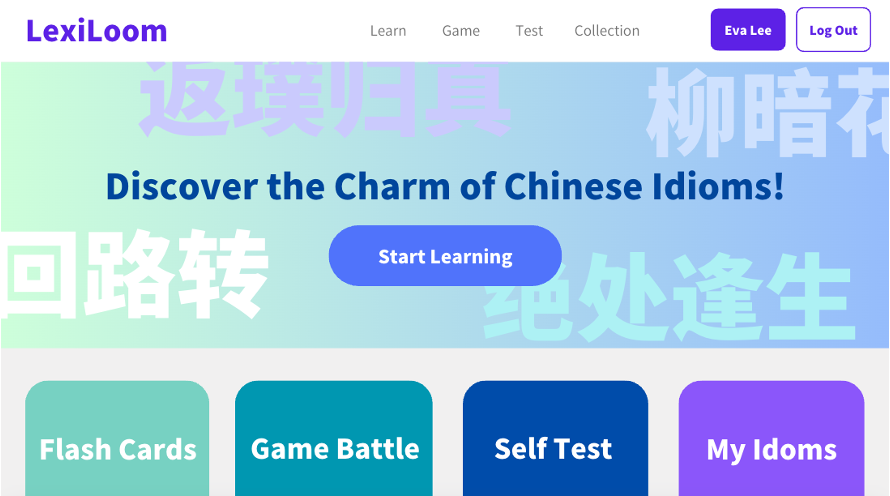
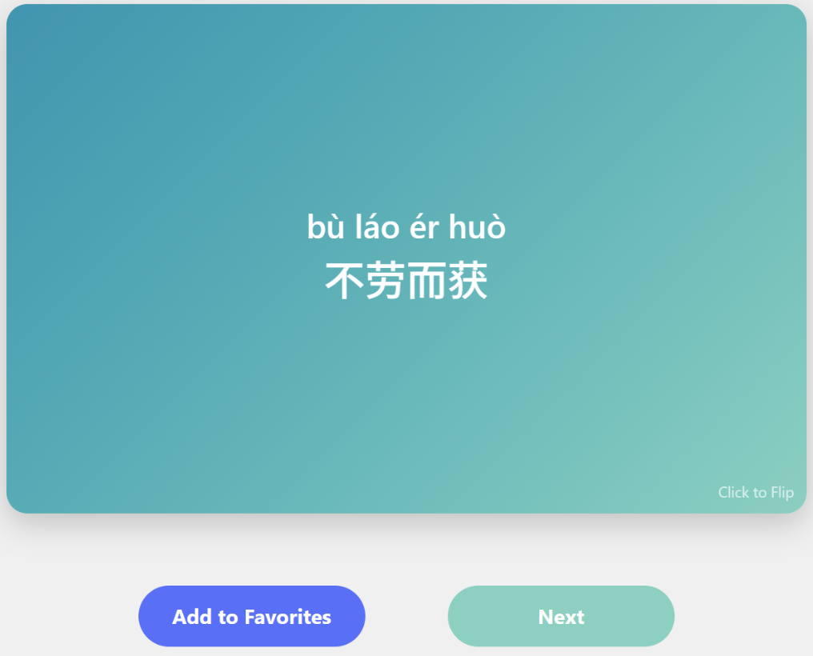
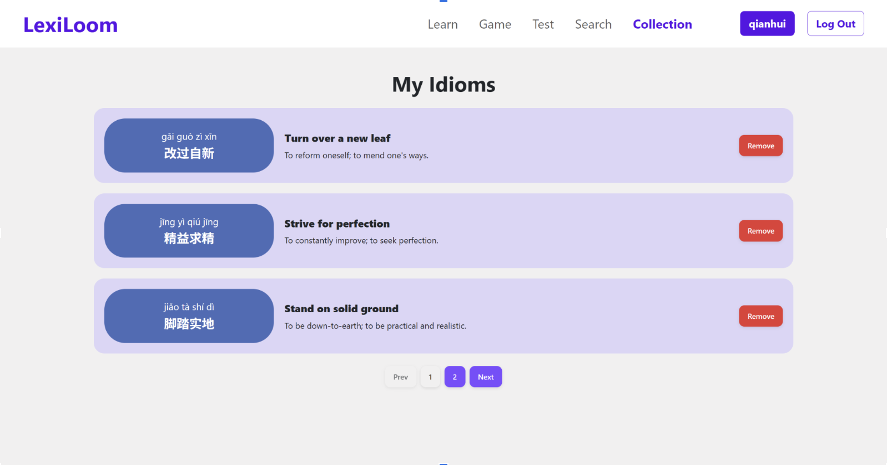
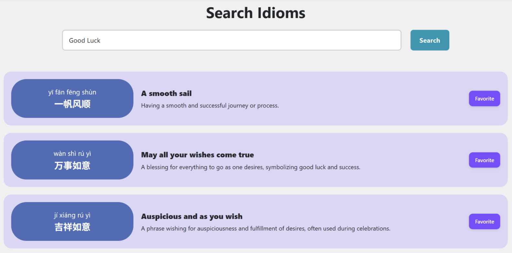
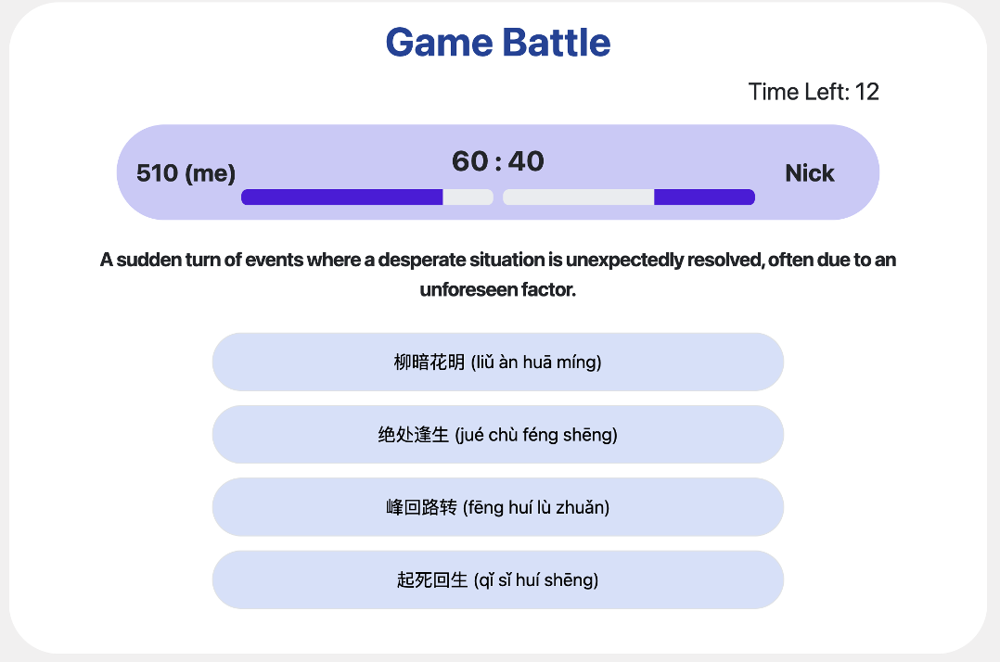
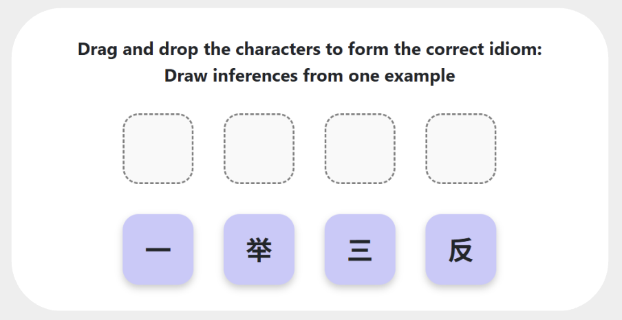
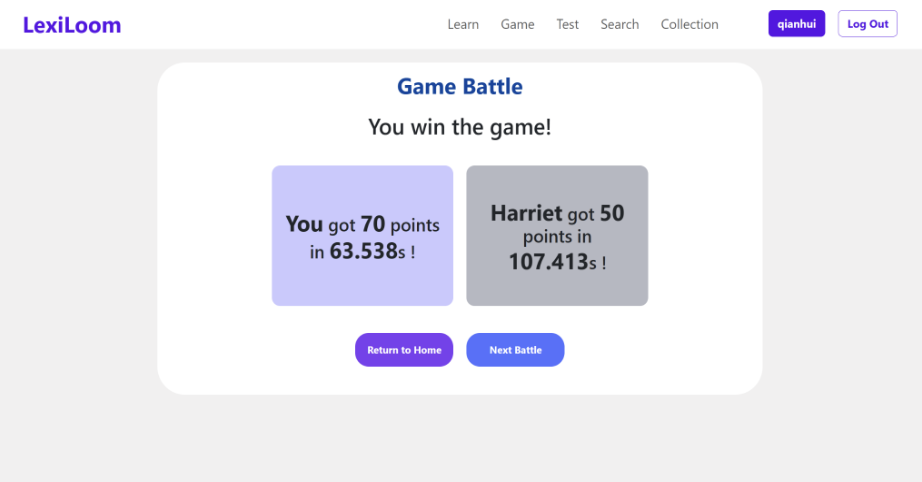
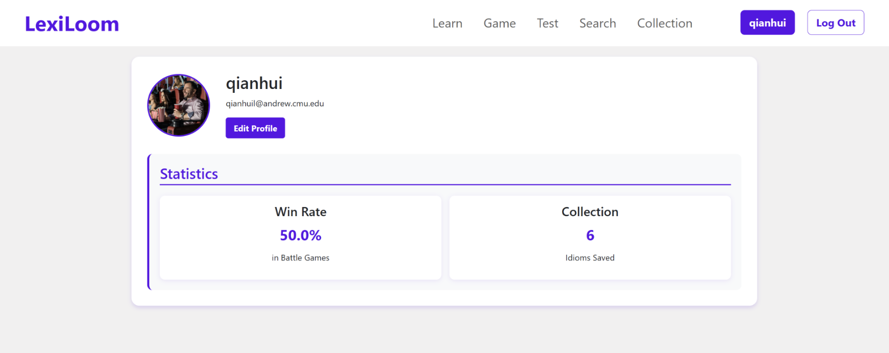

# LexiLoom - A Chinese Idiom Learning Platform
## Background

Our project is an interactive Chinese idiom learning platform designed to make learning idioms engaging and effective. Users can explore idioms through pinyin, meanings, and the explanation of each character. Real-time word battles and self-testing features further reinforce learning through competition and practice.

## 1. Learn Module

#### Flash Card

Display a Chinese idiom along with its pinyin, translation, and explanation.

At first, the card would only display the idiom and its pinyin.

When the user clicks on the card, it would flip over, dispalying the literal meaning and explanation. When a user hovers over one character, the explanation of each character would show up.

#### Idiom Collection

Display a comprehensive list of collected idioms of the user.

#### Idiom Search (Powered by GPT4)

Search idioms based on English descriptions.

### 2. Game Module

#### Real-time Battle (Realized using WebSocket)

Compete with a random player in a timed challenge. The two players will be given 10 questions and 20 seconds to answer each question.

#### Self Test

Randomized questions for personal practice. The type of problem is the same as those of real-time battle.

### 3. User Module

#### Profile

User can customize the profile page, and track their win rate and saved idioms.

